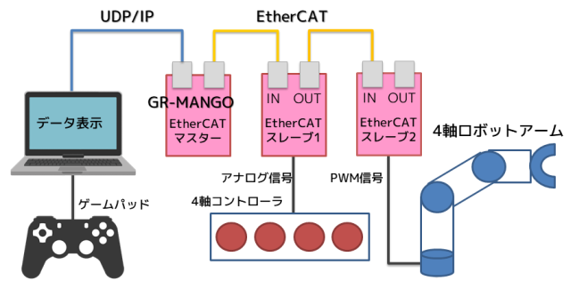

# GR-MANGO(ベータ版)でEtherCATマスター/IPv4ブリッジ

GR-MANGO(ベータ版)の2個のLANポートを活用して、片方でEtherCATマスター、もう片方でUDP/IP通信をするデモ。

## 概要

GR-MANGO(RZ/A2Mマイコン)のEthernetポートのCH0でUDP/IP、CH1でEtherCATマスターの通信をおこないます。

## 動画

## EtherCATによるロボットアーム制御
このプロジェクトは下記のプロジェクトをベースにしています。EtherCATとロボットアーム制御に関してはこちらを参照してください。

- [ArduinoでEtherCATのデモ](https://github.com/lipoyang/Arduino_de_EtherCAT)

## Ethernetドライバのハック

Ethernetドライバ(r_ether_rza2.c)とMbedのRZ_A2_EMACクラス(rza2_emac.cpp)のコールバックに関する処理の都合で、Ethernetドライバを少しハックしました。これをしないとEthernetのコールバックがCH0のものもCH1のものも全てRZ_A2_EMACクラスに持っていかれてしまいます。

## ファイル構成
- `WinMangoCAT/` : Windows用モニタ/コントロールアプリ
- `src/` : GR-MANGOソフトウェアのソース (Mbedベース)
	- `main.cpp` : メイン関数
	- `ethercat.cpp` : EtherCAT通信処理とロボットアーム制御
	- `udpip.cpp` : UDP/IP通信処理
	- `SOEM/` : SOEM(EtherCATマスター)のGR-MANGO移植版
	- `mbed-os/` : Ethernetドライバのハック版
